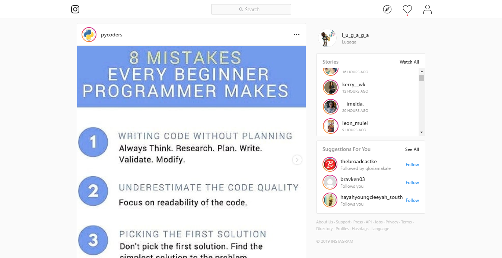
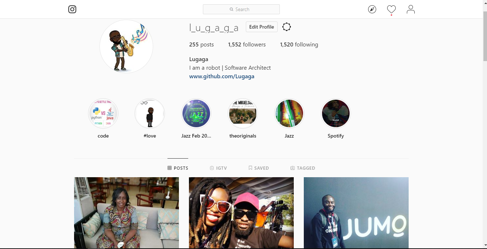
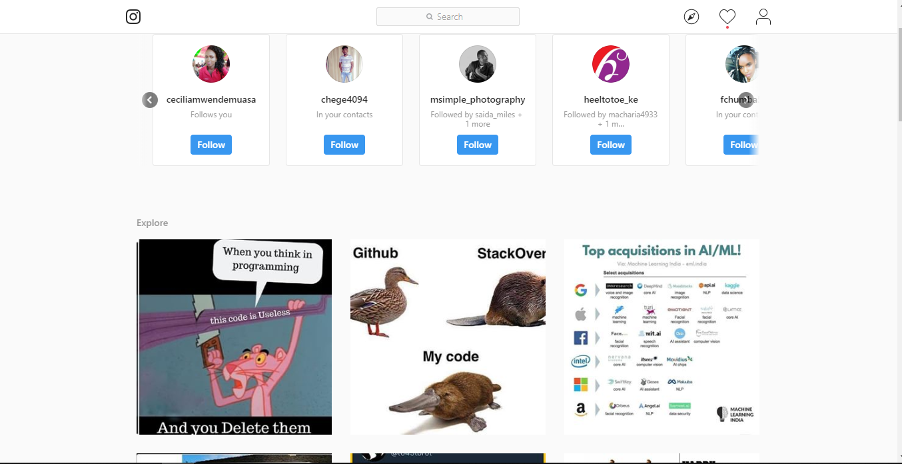
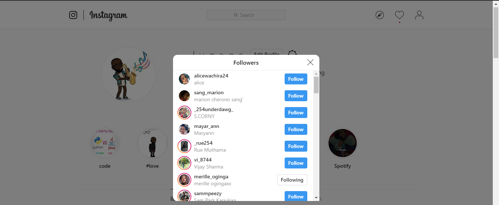
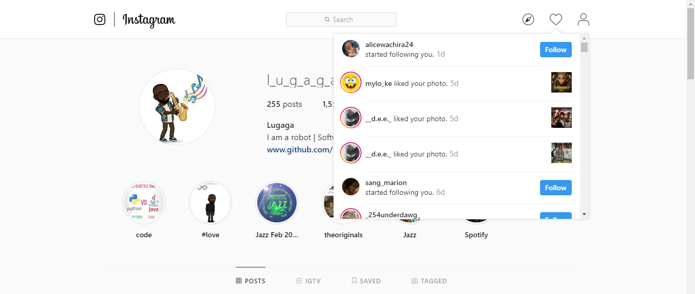
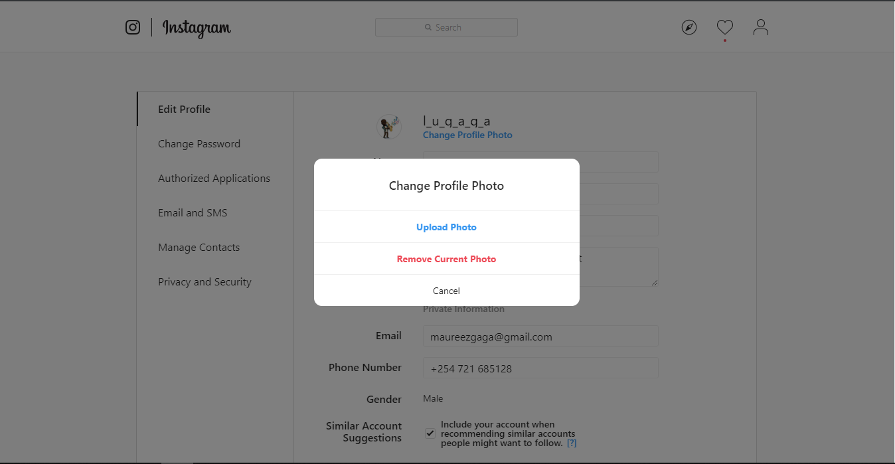
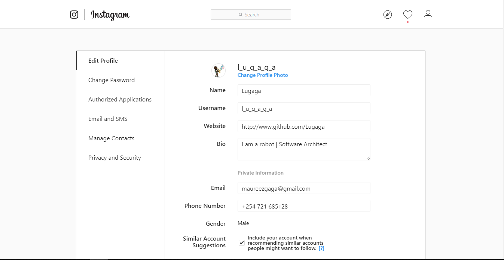

# Lugagram

#### This is an Instagram clone made with nothing but the sweet Django web framework.

#### By **Lugaga Maurice Ngulu**

## The Web Application Screengrabs.

*User Registeration | Sign Up Page

* User Login Page

* Live Feeds Page

* User Profile Page

* Explore Page

* Followers Page

* Settings Page

* Search Page

* Notifications Page

* Change Profile Page

* Edit Profile Page

## Description

This is an Instagram clone made with nothing but the sweet Django web framework.

## BDD

| Behavior | Input  | Output |
| :-------------: | :-------------: | :-------------: |
| user login | Click on login | user logged in |
| follow user | Click on follow | followed by user |
| ufollow user | Click on follow | ufollowed by user |
| like an Image | Click on like  | likes by users |
| like an Image | Click on like  | likes by users |
| upload an Image | Click on upload  | image uploaded by user |
| Comment on Image | Click on comment  | Comments written by user |
| Search for user | Enter search word and submit | users |

## Setup/Installation Requirements

* Clone Project to your machine `git clone `
* Activate a virtual environment on terminal: `source virtual/bin/activate`
* Install all the requirements found in requirements file : `pip install -r requirements.txt`
* On your terminal run `python manage.py runserver`
* Access the live site using the [local host]()
* Access the live web application by clicking on this : [Lugagagram](https://lugagagram.herokuapp.com/)

## Technologies Used

* Python3.6.
* Django 1.11.5.
* CSS3 for styling.
* HTML5 for webpage design.

## Support

* Telephone: +254 (0) 777 685 128
* Email: maureezgaga@outlook.com

### License and Copyright details

* The MIT License [MIT]()
* Copyright (c) 2019 **Engineer Lugaga**

